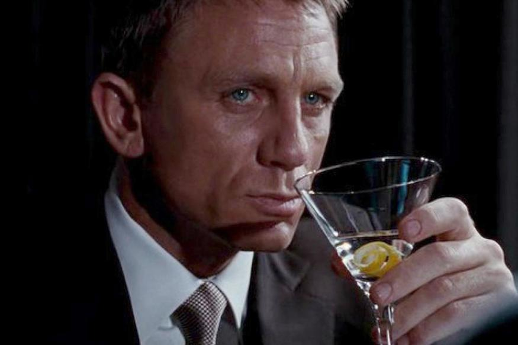

# Movie Cocktail Combo

## Description

We developed from scratch a Movie Cocktail Combo website as part of a homework for a Coding Bootcamp, to learn how to use Third party APIs.
We learn:     
    - how to use OMDB API.          
    - how to use CocktailDB API.       
    - how to make a request to an API.      
    - how to use Bulma to style the web page.   

## User Story

```
AS A Movie watcher
I WANT 
SO THAT I 
```

## Acceptance Criteria

```
GIVEN 
WHEN 
THEN
WHEN 
THEN 
WHEN 
THEN 
```


## Installation

Repository URL: https://github.com/ucb-allstars-project-1/movie-cocktail-combo 
Website URL:  https://ucb-allstars-project-1.github.io/movie-cocktail-combo/

## Usage

The following image shows the web application's appearance and functionality:



## Credits

To develop this website, We used the following tutorials:  
    - OMDB API : https://www.omdbapi.com/     
    - CocktailDB API: https://www.thecocktaildb.com/api.php                           
    - Bulma: https://bulma.io/  
    - Fetch method: https://developer.mozilla.org/en-US/docs/Web/API/fetch        

## License

Licensed under the [MIT](LICENSE) license.

